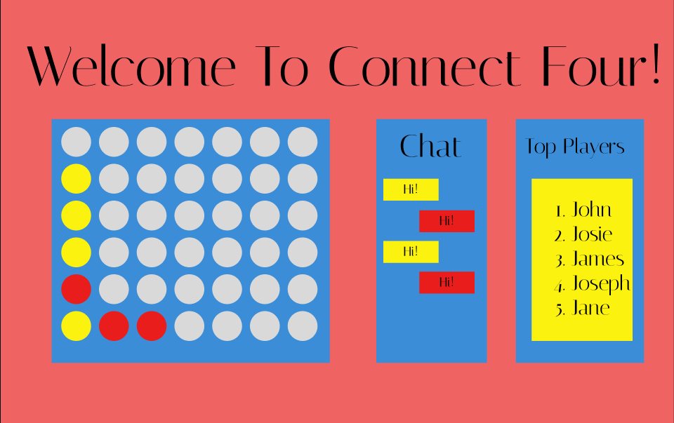

# Start Up Specification

## Connect Four

### Elevator Pitch

Have you ever wanted to discover your inner ability to connect unseen things? Have you ever needed to show your ability to detect patterns? Have you ever wanted to compete against your 8-year-old neighbor and prove your abilities in a game? Well, this is the web page for you. The Connect Four page allows you to play connect four. In real time, you can play against other people, keep track of your winning streak, play against a computer, and compare scores.

### Design

### Key Features

- Secure login over HTTPS
- Shows player win streaks
- Ability to play against other people
- Ability to play others in real time online
- Ability to play against the computer
- Results are stored persistently
- Ability for admin to delete users
- Ability to chat with other players
- Ability to turn off chat function
